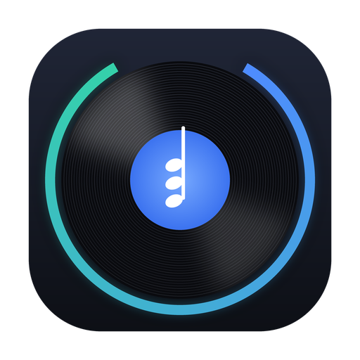

<p align="center"></p>


<p align="center">
  
</p>


<h1 align="center">Chord Injector for VirtualDJ</h1>
<p align="center"><b>V1.2.3</b> · macOS (Apple Silicon) · Windows (x64)</p>
<p align="center">
  <a href="https://github.com/owfrappier/Chord-Injector-for-VirtualDJ/releases/download/v1.2.3/Chord-Injector-for-VirtualDJ-1.2.3-macOS.pkg"><b>⬇️ macOS (.pkg)</b></a> &nbsp;·&nbsp;
  <a href="https://github.com/owfrappier/Chord-Injector-for-VirtualDJ/releases/download/v1.2.3/Chord-Injector-for-VirtualDJ-1.2.3-Windows-x64.exe"><b>⬇️ Windows (.exe)</b></a> &nbsp;·&nbsp;
  <a href="https://github.com/owfrappier/Chord-Injector-for-VirtualDJ/releases/latest">Latest release</a>
</p>
<p align="center"><a href="https://www.paypal.com/paypalme/owfrappier"><b>☕ DONATE (PayPal)</b></a></p>

> [!TIP]
> 🆕 **Simpler option — nothing written to your VirtualDJ database: [Chord Live for VirtualDJ](https://github.com/owfrappier/VIRTUALDJ-CHORDS-PLUGIN)**
> A free VirtualDJ plugin that analyses the loaded track **live**: chords, key and A = 440 Hz tuning, shown while you play. No POI, no tags, no backup needed, no need to close VirtualDJ. Works with pitch, transposition and Master Tempo.
>
> 🇫🇷 **Plus simple, sans rien écrire dans votre base VirtualDJ : [Chord Live for VirtualDJ](https://github.com/owfrappier/VIRTUALDJ-CHORDS-PLUGIN)**
> Un plugin VirtualDJ gratuit qui analyse **en direct** le morceau chargé : accords, tonalité et diapason La 440, affichés pendant que vous jouez. Ni POI, ni tags, ni sauvegarde, ni fermeture de VirtualDJ. Compatible pitch, transposition et Master Tempo.
>
> *Chord Injector remains the tool to write chords, key and tuning into the database for your whole library. · Chord Injector reste l'outil pour écrire accords, tonalité et diapason dans la base pour toute votre bibliothèque.*

---

🇬🇧 [English](#english) · 🇫🇷 [Français](#français)

---

## English

> 🎯 **Since V1.2.2 — every track in tune at A = 440 Hz, without touching the tempo.**
> The tuning POI now uses VirtualDJ's `key_smooth`: the track is shifted by the exact number of cents it is out of tune, while **the BPM stays exactly the same** — with or without Master Tempo (key lock). Before, the pitch POI also changed the tempo, and did nothing to the tuning with Master Tempo on.

**Chord Injector for VirtualDJ** analyses your music library and writes into VirtualDJ:

- 🎹 **Chords** as POI markers, aligned on VirtualDJ's own beat grid (fixed and variable BPM), with half-beat passing chords, 7ths, maj7, dim/dim7, half-diminished m7b5, 6th chords (C6, Cm6, Fm6), suspended chords (Csus2sus4, G7sus4), inversions (C/E, G7/B…) and chromatic bass lines (Cm → Cm/B → Cm/Bb). Richer names are only given when the audio clearly supports them: the main harmony always comes first.
- 🎚️ **Fine tuning to A = 440 Hz, tempo unchanged**: the tuning of each track is measured to the cent and a tuning POI is added (named in cents, e.g. `-43.6c`, action `key_smooth`), so tracks play in tune with synths, VSTs or a piano — **the BPM does not move**, with or without Master Tempo.
- 🔑 **Key** of the track, deduced from its chords — written to the VirtualDJ database, to the audio file tag (`TKEY`), or both.

Full library (≈ 12 000 tracks) analysed in about **30 minutes** on a recent Mac.

### Download & install

Get the latest version in **[Releases](https://github.com/owfrappier/Chord-Injector-for-VirtualDJ/releases/latest)**.
The former Python / AppleScript version (V13) is still available in the older releases of this repository.

- **macOS**: open the **.pkg** installer (signed and notarised by Apple), the app is installed in Applications.
- **Windows**: download and run *Chord-Injector-for-VirtualDJ-…-Windows-x64.exe* (nothing to install). The app is not signed: if SmartScreen shows "Windows protected your PC", click **More info** → **Run anyway**.

Requirements: **VirtualDJ 2026 (build 9295 or newer)**, tracks already analysed by VirtualDJ (BPM / beat grid).

**ffmpeg** (auto-detected, or choose it in the app):

- **Windows — recommended**: needed for M4A / AAC / ALAC and videos. Install it by typing in a terminal (PowerShell):
  ```
  winget install ffmpeg
  ```
  then restart the app (or click **Auto**).
- **macOS — optional**: only for `.mkv` / `.webm` videos and rare formats: `brew install ffmpeg`.

### How to use

1. **VirtualDJ database** — detected automatically: the database of the external drive first (`/Volumes/<drive>/VirtualDJ/database.xml`, `E:\VirtualDJ\database.xml`), otherwise the internal one. Use *Other…* to pick another.
2. **Tracks** — *One track* (search by title / artist) or *Whole database*.
3. **Analyse**, check the log, then **Write to VirtualDJ**.
4. To remove our markers: **Clear chords / tuning POI** (one track or the whole database) removes the chord POIs and / or the tuning POI, depending on the boxes ticked. Keys, cues, loops and automix points are kept.

**Updating from V1.2:** re-analyse and write again (tick *Re-do tracks that already have chords*): the old `pitch_zero` POIs are replaced by the new `key_smooth` ones.

### Chord Display — plugin for VirtualDJ (add-on, October 4, 2026)

**Download:** [macOS (Apple Silicon) — Chord-Display-for-VirtualDJ-1.2.3-macOS.zip](https://github.com/owfrappier/Chord-Injector-for-VirtualDJ/releases/download/v1.2.3/Chord-Display-for-VirtualDJ-1.2.3-macOS.zip) · [Windows — ChordDisplay.dll](https://github.com/owfrappier/Chord-Injector-for-VirtualDJ/releases/download/v1.2.3/ChordDisplay.dll)

A free VirtualDJ effect that shows the chords **while you play**, in its own floating window:
- the current chord in big letters, and the next chords **scrolling** under a vertical playhead, like the waveform;
- beat marks, **zoom** (− / +) and **7 colours** (blue, violet, red, yellow, white, green, gold);
- **follows the transposition** of the deck (key + 2 → Am becomes Bm);
- the sound is not changed; nothing is written to the database. It reads the chords written by Chord Injector.

**Install** (VirtualDJ closed):
- **macOS (Apple Silicon)**: unzip `Chord-Display-for-VirtualDJ-…-macOS.zip` (signed and notarised by Apple) and copy `ChordDisplay.bundle` to
  `~/Library/Application Support/VirtualDJ/PluginsMacArm/SoundEffect/`
  (Finder: Go → Go to Folder…, paste the path; create the `SoundEffect` folder if it does not exist).
- **Windows**: copy `ChordDisplay.dll` to
  `%LOCALAPPDATA%\VirtualDJ\Plugins64\SoundEffect\`
  (Windows + R, paste the path; create the `SoundEffect` folder if it does not exist — not in `Visualisation`).
  Older VirtualDJ installations may use `Documents\VirtualDJ\Plugins64\SoundEffect\` instead.

Then start VirtualDJ, choose **Chord Display** in the effects of a deck and open its window.

### Safety

- VirtualDJ is **always closed while writing** (it rewrites its database when quitting), then reopened.
- A **backup** `database.backup-YYYYMMDD-HHMMSS.xml` is created next to the database at every write (last 20 kept).
- Audio tags: only the `TKEY` tag is changed, in place; audio data and other tags are untouched. ⚠️ There is no backup of audio tags — your previous keys stay in the database backup.
- Use at your own risk. Not affiliated with VirtualDJ / Atomix Productions.

### Tip

The first chord is placed 0.25 s after the tuning POI. If the two labels overlap in VirtualDJ, **zoom in on the waveform**.

**Bigger chord names:** the size of POI labels is set by your skin. Make a copy of your skin's `.zip`, open `Main.xml`, and in each `<cue>` block add a `size` attribute to the `<text … />` line (for example `size="32"`; the default is about 14–16). Put the copy in VirtualDJ's `Skins` folder and select it. Tested with the *Vanced* skin (64 `<cue>` blocks).

---

## Français

> 🎯 **Depuis la V1.2.2 — chaque morceau juste à La = 440 Hz, sans toucher au tempo.**
> La POI de diapason utilise maintenant `key_smooth` de VirtualDJ : le morceau est décalé du nombre exact de cents dont il est faux, et **le BPM reste exactement le même** — avec ou sans Master Tempo. Avant, la POI pitch changeait aussi le tempo, et ne corrigeait plus la justesse quand Master Tempo était activé.

**Chord Injector for VirtualDJ** analyse votre bibliothèque et écrit dans VirtualDJ :

- 🎹 **Les accords** en POI, calés sur la grille de beats de VirtualDJ (BPM fixe ou variable), avec accords de passage au demi-temps, 7e, maj7, dim/dim7, demi-diminués m7b5, accords de 6te (C6, Cm6, Fm6), accords suspendus (Csus2sus4, G7sus4), renversements (C/E, G7/B…) et lignes de basse chromatiques (Cm → Cm/B → Cm/Bb). Les noms enrichis ne sont donnés que si l'audio les justifie nettement : l'harmonie principale passe toujours en premier.
- 🎚️ **La correction de diapason à La = 440 Hz, tempo inchangé** : l'accordage de chaque morceau est mesuré au cent près et une POI de diapason est ajoutée (nommée en cents, ex. `-43.6c`, action `key_smooth`), pour jouer juste avec un synthé, des VST ou un piano — **le BPM ne bouge pas**, avec ou sans Master Tempo.
- 🔑 **La tonalité**, déduite des accords — écrite dans la base VirtualDJ, dans le tag du fichier audio (`TKEY`), ou les deux.

Une bibliothèque entière (≈ 12 000 morceaux) est analysée en **30 minutes environ** sur un Mac récent.

### Téléchargement et installation

Dernière version dans **[Releases](https://github.com/owfrappier/Chord-Injector-for-VirtualDJ/releases/latest)**.
L'ancienne version Python / AppleScript (V13) reste disponible dans les anciennes releases de ce dépôt.

- **macOS** : ouvrez l'installeur **.pkg** (signé et notarisé par Apple), l'app s'installe dans Applications.
- **Windows** : téléchargez et lancez *Chord-Injector-for-VirtualDJ-…-Windows-x64.exe* (rien à installer). L'application n'est pas signée : si SmartScreen affiche « Windows a protégé votre ordinateur », cliquez sur **Informations complémentaires** → **Exécuter quand même**.

Prérequis : **VirtualDJ 2026 (build 9295 ou plus récent)**, morceaux déjà analysés par VirtualDJ (BPM / grille).

**ffmpeg** (détecté automatiquement, ou à choisir dans l'app) :

- **Windows — recommandé** : nécessaire pour les M4A / AAC / ALAC et les vidéos. Installez-le en tapant dans un terminal (PowerShell) :
  ```
  winget install ffmpeg
  ```
  puis relancez l'app (ou cliquez sur **Auto**).
- **macOS — facultatif** : seulement pour les vidéos `.mkv` / `.webm` et les formats rares : `brew install ffmpeg`.

### Utilisation

1. **Base VirtualDJ** — détectée automatiquement : celle du disque externe d'abord (`/Volumes/<disque>/VirtualDJ/database.xml`, `E:\VirtualDJ\database.xml`), sinon la base interne. *Autre…* pour en choisir une autre.
2. **Morceaux** — *Un morceau* (recherche titre / artiste) ou *Toute la base*.
3. **Analyser**, vérifier le journal, puis **Écrire dans VirtualDJ**.
4. Pour retirer nos repères : **Effacer accords / POI diapason** (un morceau ou toute la base) retire les POI d'accords et / ou la POI de diapason, selon les cases cochées. Tonalités, cues, boucles et points automix sont conservés.

**Mise à jour depuis la V1.2 :** réanalysez et réécrivez (cochez *Refaire aussi les morceaux qui ont déjà des accords*) : les anciennes POI `pitch_zero` sont remplacées par les nouvelles POI `key_smooth`.

### Chord Display — plugin pour VirtualDJ (add-on du 4 octobre 2026)

**Téléchargement :** [macOS (Apple Silicon) — Chord-Display-for-VirtualDJ-1.2.3-macOS.zip](https://github.com/owfrappier/Chord-Injector-for-VirtualDJ/releases/download/v1.2.3/Chord-Display-for-VirtualDJ-1.2.3-macOS.zip) · [Windows — ChordDisplay.dll](https://github.com/owfrappier/Chord-Injector-for-VirtualDJ/releases/download/v1.2.3/ChordDisplay.dll)

Un effet VirtualDJ gratuit qui affiche les accords **pendant que vous jouez**, dans sa propre fenêtre flottante :
- l'accord en cours en grand, et les accords suivants qui **défilent** sous une tête de lecture verticale, comme la forme d'onde ;
- repères des temps, **zoom** (− / +) et **7 couleurs** (bleu, violet, rouge, jaune, blanc, vert, or) ;
- **suit la transposition** de la platine (tonalité + 2 → Am devient Bm) ;
- le son n'est pas modifié, rien n'est écrit dans la base : il lit les accords écrits par Chord Injector.

**Installation** (VirtualDJ fermé) :
- **macOS (Apple Silicon)** : décompressez `Chord-Display-for-VirtualDJ-…-macOS.zip` (signé et notarisé par Apple) et copiez `ChordDisplay.bundle` dans
  `~/Library/Application Support/VirtualDJ/PluginsMacArm/SoundEffect/`
  (Finder : Aller → Aller au dossier…, collez le chemin ; créez le dossier `SoundEffect` s'il n'existe pas).
- **Windows** : copiez `ChordDisplay.dll` dans
  `%LOCALAPPDATA%\VirtualDJ\Plugins64\SoundEffect\`
  (Windows + R, collez le chemin ; créez le dossier `SoundEffect` s'il n'existe pas — pas dans `Visualisation`).
  Sur une ancienne installation de VirtualDJ, le dossier peut être `Documents\VirtualDJ\Plugins64\SoundEffect\`.

Lancez ensuite VirtualDJ, choisissez **Chord Display** dans les effets d'une platine et ouvrez sa fenêtre.

### Sécurité

- VirtualDJ est **toujours fermé pendant l'écriture** (il réécrit sa base en quittant), puis rouvert.
- Une **sauvegarde** `database.backup-AAAAMMJJ-HHMMSS.xml` est créée à côté de la base à chaque écriture (20 gardées).
- Tags audio : seul le tag `TKEY` est modifié, sur place ; l'audio et les autres tags ne sont pas touchés. ⚠️ Pas de sauvegarde des tags audio — les anciennes tonalités restent dans la sauvegarde de la base.
- Utilisation à vos risques. Projet indépendant, non affilié à VirtualDJ / Atomix Productions.

### Astuce

Le premier accord est placé 0,25 s après la POI de diapason. Si les deux étiquettes se chevauchent dans VirtualDJ, **zoomez sur la forme d'onde**.

**Noms d'accords plus grands :** la taille des étiquettes de POI dépend de votre skin. Faites une copie du `.zip` de votre skin, ouvrez `Main.xml`, et dans chaque bloc `<cue>` ajoutez un attribut `size` à la ligne `<text … />` (par exemple `size="32"` ; par défaut environ 14 à 16). Placez la copie dans le dossier `Skins` de VirtualDJ et sélectionnez-la. Testé avec le skin *Vanced* (64 blocs `<cue>`).

---

© Olivier FRAPPIER 2026 · [DONATE](https://www.paypal.com/paypalme/owfrappier)

*Chord Injector for VirtualDJ is a free initiative by a VirtualDJ fan, to improve key detection and add chords to VirtualDJ. It is an independent product and is not affiliated with, endorsed by or sponsored by VirtualDJ or Atomix Productions. VirtualDJ is a trademark of Atomix Productions.*

*Idea, design, testing and direction: Olivier Frappier. The C++ code was written with the help of Claude (Anthropic's AI assistant), following his ideas and under his direction. · Idée, conception, tests et direction : Olivier Frappier. Le code C++ a été écrit avec l'aide de Claude (l'assistant IA d'Anthropic), sur ses idées et sous sa direction.*
